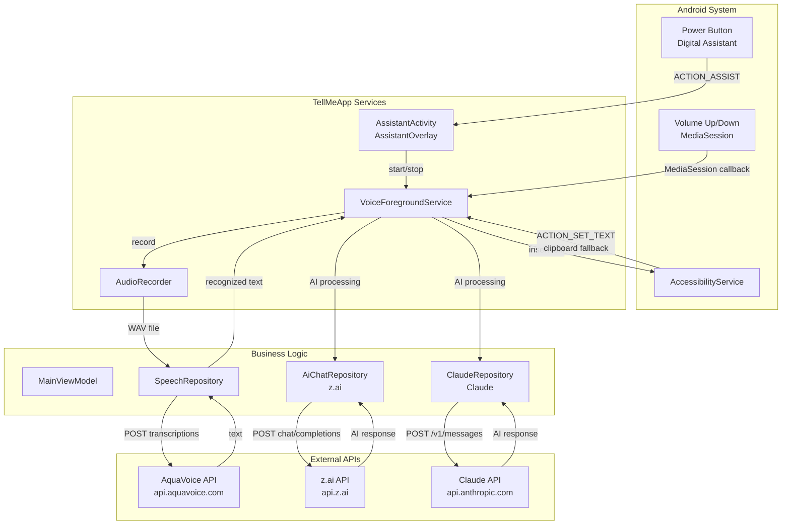
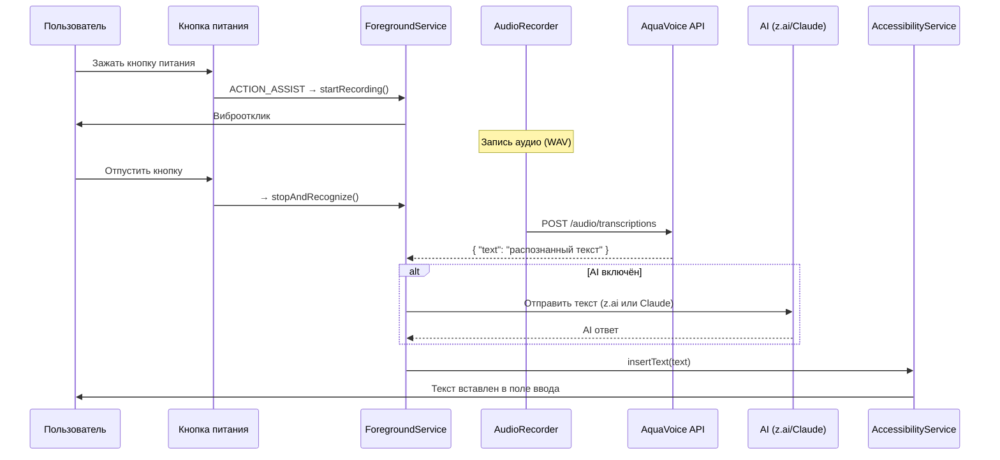

# TellMeApp — Документация проекта

## 1. Обзор проекта

**TellMeApp** — фоновое Android-приложение для голосового ввода текста в любое поле ввода на устройстве. Пользователь зажимает кнопку питания (Digital Assistant), произносит текст, отпускает — распознанный текст вставляется в позицию курсора. Опционально текст обрабатывается через AI (z.ai или Claude) перед вставкой.

### 1.1. Ключевые возможности

| # | Возможность | Описание |
|---|------------|----------|
| 1 | Голосовой ввод | Запись голоса и распознавание через AquaVoice API (Avalon) |
| 2 | Глобальный триггер | Долгое нажатие кнопки питания (Digital Assistant) или Volume Up (MediaSession) |
| 3 | Вставка текста | Автоматическая вставка распознанного текста в позицию курсора через AccessibilityService |
| 4 | AI обработка | Опциональная обработка текста через z.ai (GLM) или Claude (Anthropic) |
| 5 | Выбор провайдера | Переключатель между z.ai и Claude на главном экране |
| 6 | Подписка | Активация по ссылке, отображение статистики и срока действия |
| 7 | Фоновая работа | ForegroundService + MediaSession для работы в фоне |

### 1.2. Целевая аудитория

Пользователи, которым необходим быстрый голосовой ввод в мессенджерах (Telegram, WhatsApp и др.), почтовых клиентах и любых других приложениях с текстовыми полями.

---

## 2. Архитектура

### 2.1. Паттерн

**MVVM + Clean Architecture** с разделением на слои:

```
┌─────────────────────────────────────────────────┐
│                    UI Layer                      │
│         (Jetpack Compose + Material 3)           │
├─────────────────────────────────────────────────┤
│                 ViewModel Layer                  │
│        (State management + Use Cases)            │
├─────────────────────────────────────────────────┤
│                  Domain Layer                    │
│          (Models + Repository Interfaces)        │
├─────────────────────────────────────────────────┤
│                  Data Layer                      │
│     (Repository Impl + API + Local Storage)      │
└─────────────────────────────────────────────────┘
```

### 2.2. Основные компоненты системы



### 2.3. Поток голосового ввода



---

## 3. Технологический стек

| Компонент | Технология | Версия | Назначение |
|-----------|-----------|--------|------------|
| Build System | Gradle (Kotlin DSL) | 8.13 | Сборка проекта |
| Language | Kotlin | 2.0.21 | Основной язык |
| UI | Jetpack Compose | BOM 2024.09.00 | Декларативный UI |
| Design | Material 3 | — | Компоненты дизайна |
| DI | Hilt | — | Внедрение зависимостей |
| Network | OkHttp | — | HTTP-запросы к API |
| Audio | Android AudioRecord | — | Запись аудио (16kHz, 16-bit, mono) |
| Background Work | Foreground Service | — | Фоновая работа приложения |
| Accessibility | AccessibilityService | — | Вставка текста в чужие поля |
| Local Storage | DataStore (Preferences) | — | Хранение настроек и ключей |
| Serialization | Kotlinx Serialization | — | Парсинг JSON ответов API |
| Navigation | Compose Navigation | — | Навигация между экранами |
| Media | MediaSessionCompat | — | Перехват кнопок громкости |

---

## 4. Интеграции с внешними API

### 4.1. AquaVoice API (распознавание речи)

| Параметр | Значение |
|----------|----------|
| Base URL | `https://api.aquavoice.com/api/v1` |
| Модель | `avalon-v1.5` |
| Auth | `Authorization: Bearer <api-key>` |
| Формат | OpenAI Whisper-compatible |

**Endpoint:** `POST /audio/transcriptions` (multipart/form-data)

### 4.2. z.ai API (AI обработка)

| Параметр | Значение |
|----------|----------|
| Base URL | `https://api.z.ai/api/coding/paas/v4` |
| Модель | `glm-5.1` |
| Auth | `Authorization: Bearer <token>` |
| Формат | OpenAI Chat Completions-compatible |

**Endpoint:** `POST /chat/completions`

**Request:**
```json
{
  "model": "glm-5.1",
  "messages": [
    {"role": "system", "content": "You are a helpful AI assistant..."},
    {"role": "user", "content": "текст пользователя"}
  ]
}
```

**Response:**
```json
{
  "choices": [{"message": {"role": "assistant", "content": "ответ AI"}}]
}
```

### 4.3. Claude API (AI обработка)

| Параметр | Значение |
|----------|----------|
| Base URL | `https://api.anthropic.com` |
| Модель | `claude-sonnet-4-20250514` |
| Auth | `x-api-key: <api-key>` |
| Version | `anthropic-version: 2023-06-01` |

**Endpoint:** `POST /v1/messages`

**Request:**
```json
{
  "model": "claude-sonnet-4-20250514",
  "max_tokens": 1024,
  "system": "You are a helpful AI assistant...",
  "messages": [{"role": "user", "content": "текст пользователя"}]
}
```

**Response:**
```json
{
  "content": [{"type": "text", "text": "ответ AI"}],
  "stop_reason": "end_turn"
}
```

---

## 5. Структура проекта

```
app/src/main/java/com/TellMeUp/tellmeapp/
├── di/
│   ├── NetworkModule.kt            # OkHttpClient + Json
│   └── RepositoryModule.kt         # Hilt bindings
├── data/
│   ├── remote/
│   │   ├── api/
│   │   │   ├── AquaVoiceApi.kt     # Speech-to-text API
│   │   │   ├── AiChatApi.kt        # z.ai Chat Completions
│   │   │   └── ClaudeApi.kt        # Claude Messages API
│   │   └── dto/
│   │       ├── TranscriptionResponse.kt
│   │       ├── ChatCompletionDto.kt
│   │       └── ClaudeMessageDto.kt
│   ├── local/
│   │   └── PreferencesStore.kt     # DataStore (keys, settings, provider)
│   └── repository/
│       ├── SpeechRepositoryImpl.kt
│       ├── SubscriptionRepositoryImpl.kt
│       ├── AiChatRepositoryImpl.kt
│       └── ClaudeRepositoryImpl.kt
├── domain/
│   ├── model/
│   │   ├── VoiceState.kt           # IDLE, RECORDING, PROCESSING, AI_PROCESSING
│   │   ├── AiProvider.kt           # ZAI, CLAUDE
│   │   ├── Subscription.kt
│   │   └── Transcription.kt
│   ├── repository/
│   │   ├── SpeechRepository.kt
│   │   ├── SubscriptionRepository.kt
│   │   ├── AiChatRepository.kt
│   │   └── ClaudeRepository.kt
│   └── usecase/
│       ├── RecognizeSpeechUseCase.kt
│       ├── SendAiMessageUseCase.kt
│       ├── SendClaudeMessageUseCase.kt
│       ├── ActivateSubscriptionUseCase.kt
│       └── GetSubscriptionStatusUseCase.kt
├── service/
│   ├── VoiceForegroundService.kt   # Recording + recognition + AI + insertion
│   ├── VoiceAccessibilityService.kt # Text insertion at cursor
│   ├── AudioRecorder.kt            # WAV recording
│   ├── StopServiceReceiver.kt      # Notification stop button
│   └── VolumeButtonDetector.kt     # Double-press detector (legacy)
├── ui/
│   ├── theme/
│   │   ├── Color.kt
│   │   ├── Theme.kt
│   │   └── Type.kt
│   ├── component/
│   │   └── StatusIndicator.kt
│   ├── navigation/
│   │   └── AppNavigation.kt
│   └── screen/
│       ├── main/
│       │   ├── MainScreen.kt       # Service control + AI toggle + provider selector
│       │   └── MainViewModel.kt
│       ├── subscription/
│       │   ├── SubscriptionScreen.kt
│       │   └── SubscriptionViewModel.kt
│       ├── settings/
│       │   ├── SettingsScreen.kt   # API keys (AquaVoice, z.ai, Claude) + toggles
│       │   └── SettingsViewModel.kt
│       ├── assistant/
│       │   ├── AssistantActivity.kt
│       │   ├── AssistantOverlay.kt
│       │   └── AssistantViewModel.kt
│       └── logs/
│           └── LogsScreen.kt       # In-app log viewer
└── util/
    └── AppLogger.kt                # Ring-buffer logger
```

---

## 6. Экраны приложения

### 6.1. Главный экран (Main)

- Кнопка СТАРТ/СТОП СЕРВИС
- Инструкция: кнопка питания → API ключ → AI ассистент
- Переключатель AI ассистент (вкл/выкл)
- Селектор провайдера (z.ai / Claude) — виден при включённом AI
- Кнопка ручной записи (круглая)
- Результат распознавания

### 6.2. Экран подписки (Subscription)

- Поле ввода ссылки активации
- Карточка с информацией о подписке (статус, срок, тариф)
- Кнопка "Активировать"

### 6.3. Экран настроек (Settings)

- API ключ AquaVoice (распознавание речи)
- API ключ z.ai (AI обработка, GLM Coding Plan)
- API ключ Claude (AI обработка, Anthropic)
- Переключатели: виброотклик, визуальное уведомление
- Тёмная тема

### 6.4. Ассистент (AssistantOverlay)

- Прозрачный оверлей при запуске через Digital Assistant
- Автозапись при открытии
- Тап для остановки и распознавания

---

## 7. Ключевые технические решения

### 7.1. Триггер записи

**Основной:** Digital Assistant (кнопка питания) через `ACTION_ASSIST` intent → `AssistantActivity`.
**Резервный:** MediaSession для перехвата Volume Up/Down (долгое нажатие 400мс).

### 7.2. Вставка текста в чужое поле ввода

Через `AccessibilityService`:
1. Определение текущего фокусированного `AccessibilityNodeInfo`
2. Проверка `isEditable` у узла
3. Вставка в позицию курсора через `textSelectionStart/End`
4. Fallback: копирование в clipboard + `ACTION_PASTE`

### 7.3. AI обработка

Распознанный текст опционально отправляется в AI:
- **z.ai** (GLM Coding Plan) — OpenAI Chat Completions-compatible, Bearer auth
- **Claude** (Anthropic) — Messages API, `x-api-key` + `anthropic-version` headers
- Провайдер выбирается на главном экране, сохраняется в DataStore
- Ответ AI вставляется вместо оригинального текста
- При ошибке AI — fallback на оригинальный распознанный текст

### 7.4. Фоновый сервис

`ForegroundService` с постоянным уведомлением. Держит `MediaSession`, `AudioRecorder`, все repository/use case инстансы. Маршрутизирует AI запросы к выбранному провайдеру.

---

## 8. Этапы разработки

### Этап 1: Базовая инфраструктура (MVP) — завершён
### Этап 2: Голосовое распознавание — завершён
### Этап 3: Вставка текста — завершён
### Этап 4: Подписка и статистика — завершён
### Этап 5: Полировка и релиз — завершён
### Этап 6: Digital Assistant — завершён
### Этап 7: Исправление триггера Volume Up — завершён
### Этап 8: AI ассистент (z.ai) — завершён
### Этап 9: Поддержка нескольких AI провайдеров (z.ai + Claude) — завершён

---

## 9. Безопасность

| Аспект | Решение |
|--------|---------|
| Хранение API-ключей | DataStore (не Encrypted, MVP) |
| Передача данных | HTTPS (TLS) |
| Разрешения | RECORD_AUDIO, FOREGROUND_SERVICE, ACCESSIBILITY |
| Приватность | Аудио не хранится, отправляется напрямую в API |

---

## 10. Разрешения приложения

```xml
<uses-permission android:name="android.permission.RECORD_AUDIO" />
<uses-permission android:name="android.permission.FOREGROUND_SERVICE" />
<uses-permission android:name="android.permission.FOREGROUND_SERVICE_SPECIAL_USE" />
<uses-permission android:name="android.permission.POST_NOTIFICATIONS" />
<uses-permission android:name="android.permission.INTERNET" />
<uses-permission android:name="android.permission.VIBRATE" />
```
