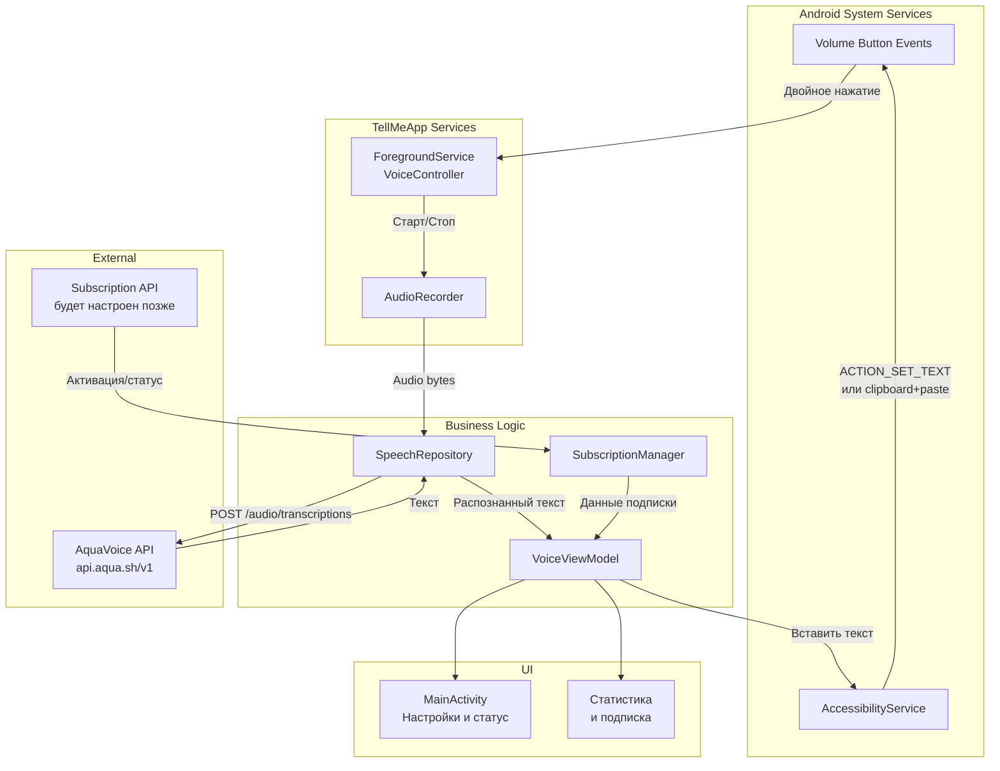
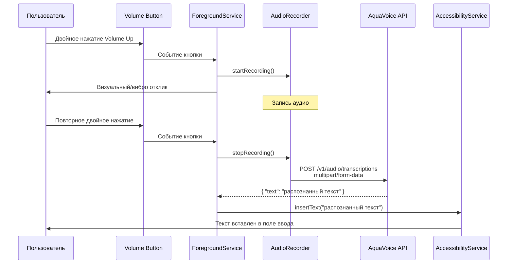

# TellMeApp — Документация проекта

## 1. Обзор проекта

**TellMeApp** — фоновое Android-приложение для голосового ввода текста в любое поле ввода на устройстве. Пользователь нажимает кнопку увеличения громкости (двойное нажатие), произносит текст, повторно нажимает кнопку — распознанный текст вставляется в позицию курсора.

### 1.1. Ключевые возможности

| # | Возможность | Описание |
|---|------------|----------|
| 1 | Голосовой ввод | Запись голоса и распознавание через AquaVoice API (Avalon) |
| 2 | Глобальный триггер | Двойное нажатие кнопки увеличения громкости в любом приложении |
| 3 | Вставка текста | Автоматическая вставка распознанного текста в позицию курсора |
| 4 | Подписка | Активация по ссылке (формат `https://s.axolab.org/...`), отображение статистики и срока действия |
| 5 | Фоновая работа | Приложение работает как фоновый сервис, не требует открытого UI |

### 1.2. Целевая аудитория

Пользователи, которым необходим быстрый голосовой ввод в мессенджерах (Telegram, WhatsApp и др.), почтовых клиентах и любых других приложениях с текстовыми полями.

---

## 2. Архитектура

### 2.1. Паттерн

**MVVM + Clean Architecture** с разделением на слои:

```
┌─────────────────────────────────────────────────┐
│                    UI Layer                      │
│         (Jetpack Compose + Material 3)           │
├─────────────────────────────────────────────────┤
│                 ViewModel Layer                  │
│        (State management + Use Cases)            │
├─────────────────────────────────────────────────┤
│                  Domain Layer                    │
│          (Models + Repository Interfaces)        │
├─────────────────────────────────────────────────┤
│                  Data Layer                      │
│     (Repository Impl + API + Local Storage)      │
└─────────────────────────────────────────────────┘
```

### 2.2. Основные компоненты системы



### 2.3. Поток голосового ввода



---

## 3. Технологический стек

| Компонент | Технология | Версия | Назначение |
|-----------|-----------|--------|------------|
| Build System | Gradle (Kotlin DSL) | 8.13 | Сборка проекта |
| Language | Kotlin | 2.0.21 | Основной язык |
| UI | Jetpack Compose | BOM 2024.09.00 | Декларативный UI |
| Design | Material 3 | — | Компоненты дизайна |
| DI | Hilt | — | Внедрение зависимостей |
| Network | OkHttp + Retrofit | — | HTTP-запросы к AquaVoice API |
| Audio | Android AudioRecord | — | Запись аудио |
| Background Work | Foreground Service | — | Фоновая работа приложения |
| Accessibility | AccessibilityService | — | Вставка текста в чужие поля |
| Local Storage | DataStore (Preferences) | — | Хранение настроек и ключей |
| Serialization | Kotlinx Serialization | — | Парсинг JSON ответов API |
| Navigation | Compose Navigation | — | Навигация между экранами |

---

## 4. Интеграция с AquaVoice API

### 4.1. Параметры подключения

| Параметр | Значение |
|----------|----------|
| Base URL | `https://api.aqua.sh/v1` |
| Модель | `avalon-1` |
| Auth | `Authorization: Bearer <api-key>` |
| Формат | OpenAI Whisper-compatible |

### 4.2. Основной endpoint

**`POST /v1/audio/transcriptions`**

**Request:** `multipart/form-data`
```
model: "avalon-1"
file: <audio_file.wav>
```

**Response:**
```json
{
  "text": "распознанный текст"
}
```

### 4.3. Поддерживаемые параметры

| Параметр | Тип | Описание |
|----------|-----|----------|
| `model` | string | `"avalon-1"` |
| `file` | binary | Аудиофайл (WAV, MP3 и др.) |
| `language` | string | Код языка (опционально) |
| `response_format` | string | `json` (по умолчанию), `verbose_json` |
| `stream` | boolean | Потоковый режим (SSE) |

---

## 5. Структура проекта (целевая)

```
app/src/main/java/com/example/tellmeapp/
├── di/                             # Hilt модули
│   ├── AppModule.kt
│   ├── NetworkModule.kt
│   └── RepositoryModule.kt
├── data/
│   ├── remote/
│   │   ├── api/
│   │   │   └── AquaVoiceApi.kt     # Retrofit интерфейс
│   │   ├── dto/
│   │   │   ├── TranscriptionRequest.kt
│   │   │   └── TranscriptionResponse.kt
│   │   └── subscription/
│   │       └── SubscriptionApi.kt  # API подписок (позже)
│   ├── local/
│   │   └── PreferencesStore.kt     # DataStore настройки
│   └── repository/
│       ├── SpeechRepositoryImpl.kt
│       └── SubscriptionRepositoryImpl.kt
├── domain/
│   ├── model/
│   │   ├── Transcription.kt
│   │   ├── Subscription.kt
│   │   └── VoiceState.kt
│   ├── repository/
│   │   ├── SpeechRepository.kt
│   │   └── SubscriptionRepository.kt
│   └── usecase/
│       ├── RecognizeSpeechUseCase.kt
│       ├── ActivateSubscriptionUseCase.kt
│       └── GetSubscriptionStatusUseCase.kt
├── service/
│   ├── VoiceForegroundService.kt   # Фоновый сервис управления
│   ├── VoiceAccessibilityService.kt # Вставка текста
│   └── AudioRecorder.kt            # Запись аудио
├── ui/
│   ├── theme/
│   │   ├── Color.kt
│   │   ├── Theme.kt
│   │   └── Type.kt
│   ├── navigation/
│   │   └── AppNavigation.kt
│   ├── screen/
│   │   ├── main/
│   │   │   ├── MainScreen.kt       # Главный экран (статус)
│   │   │   └── MainViewModel.kt
│   │   ├── subscription/
│   │   │   ├── SubscriptionScreen.kt
│   │   │   └── SubscriptionViewModel.kt
│   │   └── settings/
│   │       ├── SettingsScreen.kt
│   │       └── SettingsViewModel.kt
│   └── component/
│       ├── StatusIndicator.kt      # Индикатор статуса записи
│       ├── SubscriptionCard.kt     # Карточка подписки
│       └── PowerButton.kt          # Кнопка включения (стиль Happ)
├── util/
│   ├── VolumeButtonDetector.kt     # Детектор двойного нажатия
│   ├── TextInserter.kt             # Вставка текста через Accessibility
│   └── Constants.kt
└── MainActivity.kt
```

---

## 6. Экраны приложения

### 6.1. Главный экран (Main)

Стиль: аналог Happ — тёмный фон, центральная кнопка статуса.

- **Центральный элемент**: большая круглая кнопка (стиль power button из Happ), показывающая статус сервиса
  - Серая — сервис остановлен
  - Голубая с glow — сервис активен, ожидает команду
  - Пульсирующая красная — идёт запись голоса
- **Под кнопкой**: текст статуса ("Готов к работе" / "Запись..." / "Обработка...")
- **Нижняя панель**: статистика использования (количество распознаваний, минуты аудио)

### 6.2. Экран подписки (Subscription)

- Поле ввода ссылки активации
- Карточка с информацией о подписке:
  - Статус (активна / неактивна)
  - Срок действия
  - Статистика использования (запросов, минут)
- Кнопка "Активировать"

### 6.3. Экран настроек (Settings)

- Язык распознавания (по умолчанию — авто)
- API-ключ (для тестового режима — ручной ввод)
- Виброотклик при нажатии (вкл/выкл)
- Визуальное уведомление при записи (вкл/выкл)
- Тема (тёмная/светлая)

---

## 7. Ключевые технические решения

### 7.1. Детекция двойного нажатия Volume Up

Используется `AccessibilityService` с перехватом `KEYEVENT` через `onKeyEvent`. Альтернатива — `MediaSession` для перехвата кнопок громкости, но AccessibilityService даёт больше контроля и позволяет одновременно вставлять текст.

**Алгоритм**: первое нажатие запускает таймер (300мс), если второе нажатие приходит до истечения таймера — это двойное нажатие.

### 7.2. Вставка текста в чужое поле ввода

Через `AccessibilityService`:
1. Определение текущего фокусированного `AccessibilityNodeInfo`
2. Проверка `isEditable` у узла
3. `Bundle` с `ACTION_SET_TEXT` для вставки текста
4. Fallback: копирование в clipboard + `ACTION_PASTE`

### 7.3. Фоновый сервис

`ForegroundService` с постоянным уведомлением — обязателен для работы `AudioRecord` и `AccessibilityService` в фоне. Показывает уведомление "TellMeApp активен" с кнопкой быстрого выключения.

---

## 8. Этапы разработки

### Этап 1: Базовая инфраструктура (MVP)
- Настройка архитектуры (Hilt, навигация, структура пакетов)
- Базовый UI главного экрана (стиль Happ)
- `ForegroundService` с уведомлением
- `AudioRecorder` — запись аудио

### Этап 2: Голосовое распознавание
- Интеграция AquaVoice API (Retrofit)
- Детектор двойного нажатия Volume Up
- Поток записи → API → получение текста

### Этап 3: Вставка текста
- `AccessibilityService` для вставки текста
- Определение фокусированного поля
- Реализация вставки (`ACTION_SET_TEXT` / clipboard fallback)

### Этап 4: Подписка и статистика
- Экран подписки
- Активация по ссылке
- Отображение статистики и срока действия
- (API подписок будет подключён позже, пока — mock)

### Этап 5: Полировка и релиз
- Настройки (язык, вибро, тема)
- Обработка ошибок и edge cases
- Оптимизация батареи
- Тестирование

---

## 9. Безопасность

| Аспект | Решение |
|--------|---------|
| Хранение API-ключа | EncryptedSharedPreferences / Android Keystore |
| Передача данных | HTTPS (TLS 1.3) |
| Разрешения | Минимальный набор: RECORD_AUDIO, FOREGROUND_SERVICE, ACCESSIBILITY |
| Приватность | Аудио не хранится локально, отправляется напрямую в API |

---

## 10. Разрешения приложения

```xml
<uses-permission android:name="android.permission.RECORD_AUDIO" />
<uses-permission android:name="android.permission.FOREGROUND_SERVICE" />
<uses-permission android:name="android.permission.FOREGROUND_SERVICE_SPECIAL_USE" />
<uses-permission android:name="android.permission.POST_NOTIFICATIONS" />
<uses-permission android:name="android.permission.INTERNET" />
<uses-permission android:name="android.permission.VIBRATE" />
```
